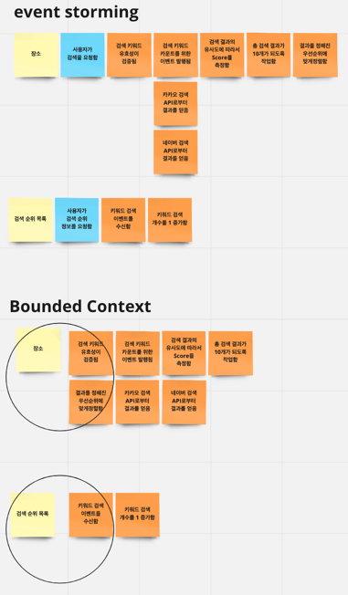

# 키워드 검색
## 테스트 방법(2가지)
### `.http` 파일 확인
- ServiceProjectSearchApplication.class 를 통해서 서버를 8080 포트로 실행시킵니다.
- http/LocalSearch.http 파일에 정의된 GET 요청을 실행시킵니다.

### 인수테스트 확인
- `test` 폴더에 `local/acceptance/LocalSearchAcceptanceTest.class`에 정의된 내용을 실행시킵니다.

## 요구사항 정리
### 장소 검색
- [ ] 장소 API 를 통해 장소를 검색합니다.
- [ ] 장소 검색 서비스 - 카카오 검색 API, 네이버 검색 API - 를 통해 각각 최대 5개씩, 총 10개의 키워드 관련 장소를 검색합니다. (특정 서비스 검색 결과가 5개 이하면 최대한 총 10개에 맞게 적용)
- [ ] 카카오 장소 검색 API의 결과를 기준으로 두 API 검색 결과에 동일하게 나타나는 문서(장소)가 상위에 올 수 있도록 정렬해주세요. 동일 업체 판단 기준은 자유롭게 결정해주세요. (예, 업체명 공백 제거 비교, 태그 제거 비교, 문자열 유사도 비교, 장소 위치 비교 등)

### 검색 키워드 목록
- [ ] 사용자들이 많이 검색한 순서대로, 최대 10개의 검색 키워드 목록을 제공합니다.

## 설계 내용과 이유

- 이벤트 스토밍의 결과를 토대로 발생하는 이벤트들을 도메인 단위로 그룹핑을 하였습니다.
- 이에 따라서 2개의 어그리거트가 있다고 생각했고 패키지 구성을 설정하였습니다.

## 핵심 문제 해결
- 동시성 이슈가 발생할 수 있는 부분을 염두에 둔 설계 및 구현 (예시. 키워드 별로 검색된 횟수)
  - 키워드 검색 카운트는 다중 서버 환경에서 증가에 대해서 무결성을 보장해야 한다고 생각했습니다.
  - 키워드 검색 카운트를 증가하기 위해서 데이터베이스의 특정 `row`를 읽을 때 `@Lock` 타입을 `LockModeType.PESSIMISTIC_WRITE`로 지정하였습니다.
  - 트래픽이 몰리는 경우 교착상태에 빠지는 것을 대비하여 `Lock`을 점유하고 있는 시간을 3초로 설정하였습니다.

- 검색 키워드 TOP 10
  - 대용량 트래픽이 몰리는 상황에서 키워드 목록의 경우 실시간으로 정확한 데이터를 요구할 필요는 없다고 생각했습니다.
  - 그래서 요청이 올 때 마다 캐싱된 데이터를 전달하고 1분마다 TOP 10 목록을 업데이트하도록 하였습니다. 

- 카카오, 네이버 등 검색 API 제공자의 “다양한” 장애 발생 상황에 대한 고려, 서비스 오류 및 장애 처리 방법에 대한 고려
  - API에 장애가 발생하면 spring에서 제공하는 retry 어노테이션을 활용하여 3번의 재요청을 할 수 있도록 하였습니다. 
  - 그럼에도 불구하고 외부 API가 장애가 발생하는 경우 DB에 저장된 내용을 리턴하도록 하였습니다.
    - 키워드 검색을 요청하면 검색 이벤트를 발행하여 검색된 결과를 DB에 저장하도록 하였습니다.

- 구글 장소 검색 등 새로운 검색 API 제공자의 추가 시 변경 영역 최소화에 대한 고려
  - 인터페이스로 추상화하여 카카오, 네이버가 검색 API 이외에 다른 API도 유연성 있게 추가할 수 있도록 설계하였습니다.
